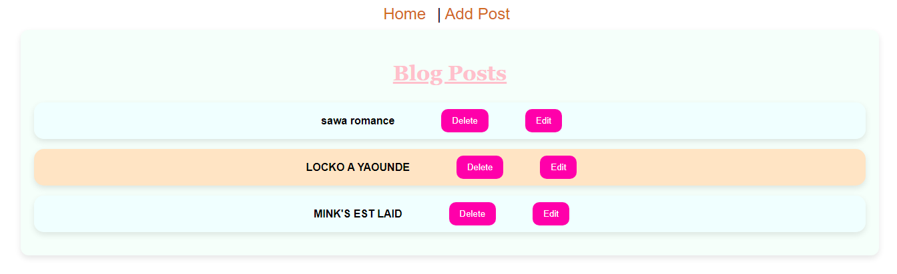

# React Blog Project

## Description

Ce projet est un blog développé avec React. Il permet d'afficher une liste d'articles, de les consulter, les modifier et les supprimer. Il utilise la bibliothèque React Router pour la navigation entre les pages.

## Fonctionnalités

- Affichage d'une liste d'articles de blog.
- Consultation du contenu de chaque article.
- Modification et suppression des articles.
- Interface simple et responsive.

## Pré-requis

Avant de pouvoir utiliser ce projet, assurez-vous d'avoir installé les éléments suivants :

- [Node.js](https://nodejs.org/) (version 14 ou supérieure)
- [npm](https://www.npmjs.com/) ou [yarn](https://yarnpkg.com/)
- React Router
- Communication avec une API (utilisation d’Axios ou Fetch).
- Backend* pour gérer les données (nous utiliserons *JSON Server* pour simplifier).

## Installation

Clonez le dépôt sur votre machine locale et installez les dépendances.

bash
git clone https://github.com/<USERNAME>/<REPO>.git
cd <REPO>
npm install

## Lancement en mode développement

Pour démarrer le projet en mode développement, exécutez la commande suivante :

bash
npm start

Cela ouvrira l'application sur `http://localhost:3000` dans votre navigateur.

## Déploiement sur GitHub Pages

Ce projet est configuré pour être déployé sur GitHub Pages. Suivez ces étapes pour déployer votre application :

1. Ajoutez l'URL de votre dépôt GitHub dans le fichier `package.json` sous la propriété `"homepage"` :
   
   json
   "homepage": "https://<USERNAME>.github.io/<REPO>"
   

2. Utilisez la commande suivante pour déployer le projet :

   bash
   npm run deploy
   

Votre site sera accessible à l'adresse `https://<USERNAME>.github.io/<REPO>`.

## Scripts Disponibles

- **`npm start`** : Lance l'application en mode développement.
- **`npm run build`** : Crée un build optimisé pour la production dans le dossier `build`.
- **`npm run deploy`** : Déploie l'application sur GitHub Pages.
- **`npm test`** : Lance les tests unitaires (si configurés).

## Contribution

Les contributions sont les bienvenues ! Pour contribuer à ce projet :

1. Forkez le dépôt.
2. Créez une branche pour vos modifications (`git checkout -b ma-branche`).
3. Effectuez vos changements et validez les (`git commit -m "Mes changements"`).
4. Poussez les sur la branche (`git push origin ma-branche`).
5. Créez une Pull Request pour que vos modifications soient examinées.

## Screenshots

## Technologies Utilisées

- [React](https://reactjs.org/) : Bibliothèque JavaScript pour la création d'interfaces utilisateur.
- [React Router](https://reactrouter.com/) : Outil de navigation pour React.
- [GitHub Pages](https://pages.github.com/) : Pour l'hébergement statique du blog.

## Auteurs

- **[Laroche237]** - Créateur et développeur principal.

## License

Ce projet est sous licence MIT. Consultez le fichier [LICENSE](LICENSE) pour plus d’informations.

### Points à Personnaliser :

- *<USERNAME>* et *<REPO>* : Remplace par ton nom d'utilisateur GitHub et le nom de ton dépôt.
- *Description* : Si ton blog a des fonctionnalités supplémentaires ou des spécificités, n'hésite pas à les détailler.
- *Installation et Lancement* : Si tu utilises d'autres outils ou étapes pour l'installation ou le lancement, adapte les instructions en conséquence.
- *Contribution* : Si tu veux fixer des règles particulières pour les contributions (tests, revues de code, etc.), tu peux les ajouter ici.

Tu peux maintenant ajouter ce fichier à la racine de ton projet et le pousser sur GitHub pour que les visiteurs puissent en profiter.